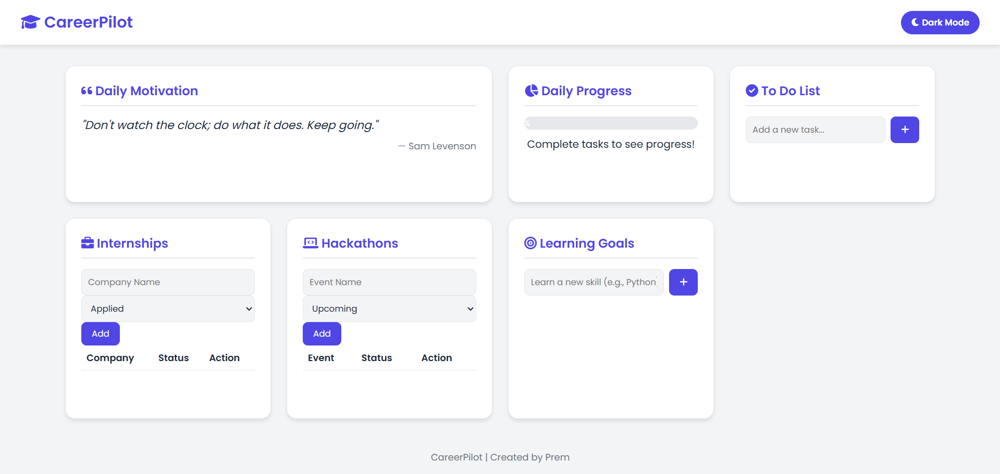
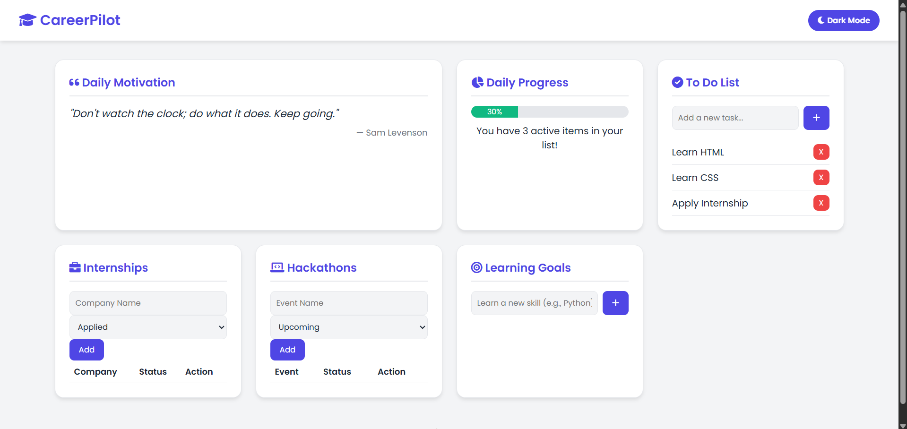
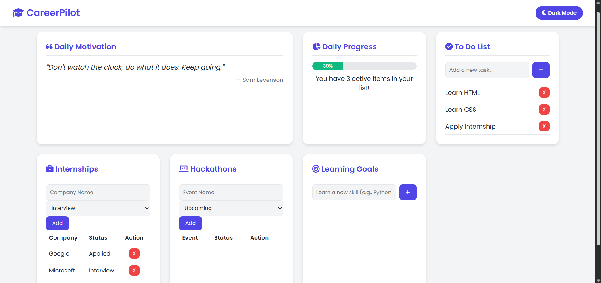
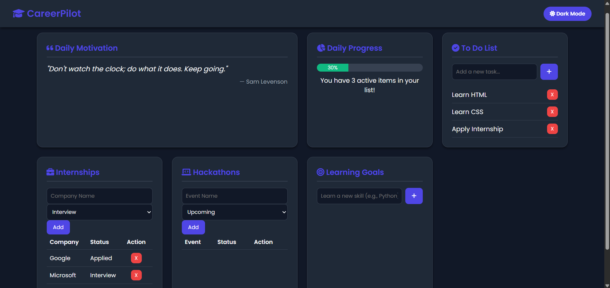

# CareerPilot

CareerPilot is a student productivity and career management dashboard designed to help students organize tasks, internships, hackathons, and learning goals in one place.

## Problem Statement

Students struggle to manage internships, hackathons, tasks and learning goals from different platforms.

## Solution

CareerPilot provides a centralized dashboard for managing productivity, career opportunities and learning progress.

## Features

- To-Do List
- Internship Tracker
- Hackathon Tracker
- Learning Goals
- Daily Progress Tracking
- Dark Mode Support
- Local Storage Support
- Upcoming Deadlines

## Tech Stack

- HTML
- CSS
- JavaScript

## Live Demo

https://premg326.github.io/career-pilot/

## Screenshots

### Home Page

### ToDo List

### Internship Tracker

### Dark Mode

### Updated Dashboard

## Future Improvements

- Skill Tracker
- Study Streak Counter
- Deadline Reminder System
- Resume Builder Integration

## Author

Prem Kumar
